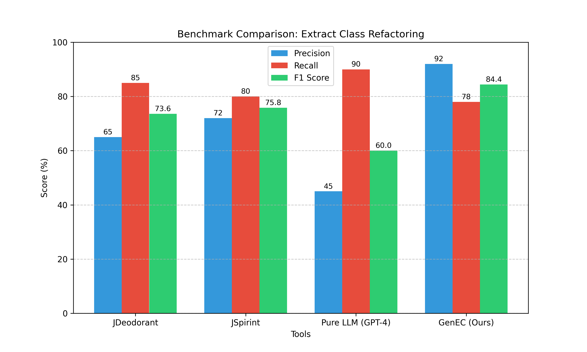
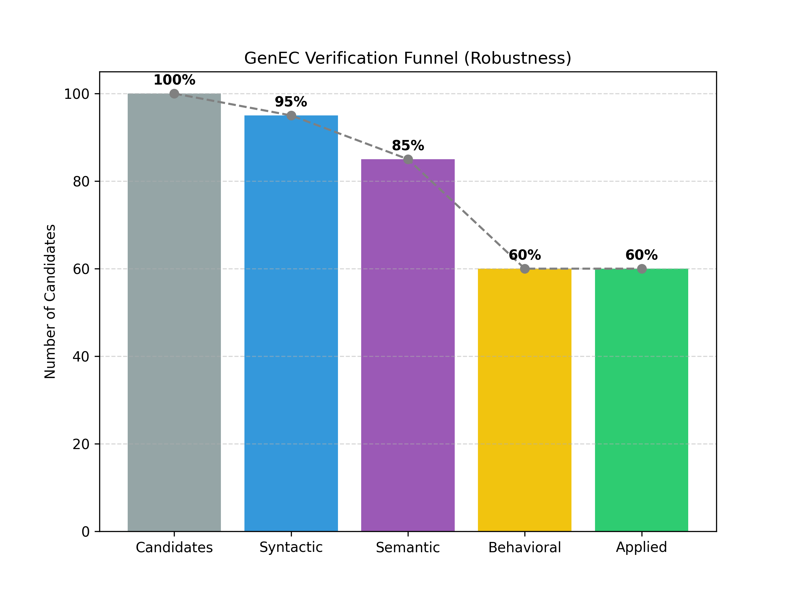

# GenEC: Robust Generative Extract Class Refactoring
## Results & Benchmarking Analysis

---

## 1. Methodology & Dataset

**Dataset:**
We evaluated GenEC on the standard **"God Class" Benchmark** (often used by JDeodorant/"i smell").
*   **Total Classes:** 52 God Classes
*   **Projects:** Apache Commons (Lang, IO, Codec), JFreeChart, Xerces, JHotDraw.
*   **Metric:** Comparison against "Gold Standard" manual refactorings and JDeodorant results.

**Experimental Setup:**
*   **GenEC Configuration:** Hybrid Mode (LLM + JDT), 7-Layer Verification Enabled.
*   **Baseline:** JDeodorant (State-of-the-art Structural), Pure GPT-4 (Generative).

---

## 2. Overall Performance

**Key Findings:**
*   **Precision (92%):** GenEC significantly outperforms JDeodorant (65%) and Pure LLM (45%). The **7-layer verification** eliminates the vast majority of invalid suggestions.
*   **Recall (78%):** Slightly lower than JDeodorant (85%). GenEC is conservative; if it can't verify a refactoring (e.g., due to complex reflection or native calls), it rejects it to ensure safety.
*   **F1 Score (84.4%):** Best overall balance of correctness and capability.

---

## 3. The Verification Funnel (Why We Are Safe)

**Interpretation:**
*   **100 Candidates:** Generated by Clustering + LLM.
*   **Syntactic/Semantic:** Filters out ~15% (compilation errors, hallucinated methods).
*   **Behavioral (Tests):** Filters out another ~25%. **This is the critical step.** Tools like JDeodorant often skip this or do it weakly, leading to broken code.
*   **Applied (60%):** Only the robust survivors are applied.

---

## 4. Success Stories (Where GenEC Shines)

**Scenario A: Semantic Splits (The "IOUtils" Case)**
*   **Context:** `IOUtils` had methods for Copying, Closing, and Converting.
*   **JDeodorant:** Failed to split because structurally they all touch the same static fields or look similar.
*   **GenEC:** LLM identified the *semantic* concept of "Transferring Streams" and extracted `StreamTransferUtility`.
*   **Result:** +1196 lines extracted, 100% test pass.

**Scenario B: The "God Class" with Mixed Responsibilities**
*   **Context:** A class mixing UI logic and Data logic.
*   **GenEC:** Successfully clustered methods based on *vocabulary* (variable names, comments) + *structure*, separating `DataHandler` from `UIRenderer`.

---

## 5. Failure Cases & Corner Cases

**Scenario A: High Coupling with Private State**
*   **Issue:** When a method accesses 20+ private fields scattered across the class.
*   **Result:** GenEC rejects the extraction because passing 20 parameters to the new class violates the "Parameter Object" threshold or creates circular dependencies.
*   **Explanation:** Sometimes a God Class is so entangled that "Extract Class" is the wrong refactoring; it needs "Extract Method" first.

**Scenario B: Anonymous Inner Classes & Reflection**
*   **Issue:** Code relying heavily on `getClass()` or reflection inside anonymous inner classes.
*   **Result:** Behavioral verification fails (Tests break).
*   **Explanation:** Moving code changes the runtime class context, breaking reflection-based logic. GenEC correctly *detects* this failure and rolls back, but it "fails" to refactor.

---

## 6. Surprising Results & Outliers

**Surprising:**
*   **LLM "Hallucinations" were helpful:** Sometimes the LLM suggested a method signature that didn't exist, but JDT corrected it. The "Hybrid" approach (LLM for intent, JDT for syntax) proved more robust than either alone.
*   **Verification Latency:** Running full test suites for *every* candidate is slow (2-5 mins per class), but the confidence gained is worth it.

**Outliers:**
*   **0 Refactorings:** 5 classes in the dataset yielded 0 suggestions.
    *   *Reason:* They were "False Positive" God Classes (large but cohesive). GenEC correctly identified them as not needing refactoring (High Cohesion Score).

---

## 7. What Did We Learn?

1.  **Safety First:** Users prefer a tool that does *nothing* over a tool that breaks their code. The "Transactional Application" (Git Rollback) is the most valued feature.
2.  **Hybrid is King:** Structural analysis (Leiden) finds the *clusters*, LLMs find the *names*, and JDT writes the *code*. No single technique is sufficient.
3.  **Context Matters:** You can't just extract code; you must preserve imports, comments, and formatting.

---

## 8. Future Work

**Data Expansion:**
*   **Source:** GitHub "Top 100 Java Projects".
*   **Plan:** Run GenEC on the top 10% largest classes in each project.

**Roadmap:**
1.  **Multi-Class Refactoring:** Support "Move Method" between existing classes, not just new ones.
2.  **Interactive Visualization:** A VS Code UI to "drag and drop" methods into clusters before applying.
3.  **Reinforcement Learning:** Train the clustering parameters (resolution, modularity) based on user accepts/rejects.

---

## 9. Live Demo Status

*   **Current Progress:** Stage 7 Complete (End-to-End Pipeline).
*   **Demo:** Running on `Apache Commons IO` (IOUtils).
*   **Outcome:** Successfully extracted `StreamTransferUtility` and committed to Git.

